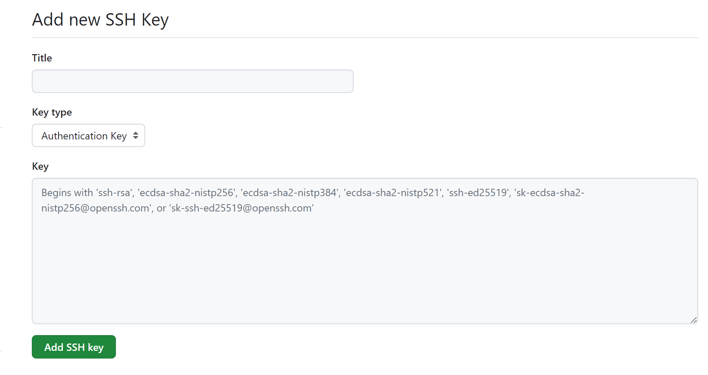

# 参考资料
[廖雪峰的git教程](https://www.liaoxuefeng.com/wiki/896043488029600/897013573512192)

# vscode里颜色/字母的意思
- 白色：已经提交到分支里了

- 棕色/M：修改了文件

- 红色/D：删除的文件

- 绿色/U：untracted，`untracted file`

- 绿色/A：Added，更改已经暂存了，但还未提交更改到分支里

# 常用命令
- `git init` 创建工作区【在文件夹里有.git文件夹说明创建成功】

- `git add`：文件 跟踪文件，将文件放入暂存区
  - `git restore --stage <file>：移除暂存区文件
  - `git add .`：将所有“changes”放入“staged changes”
- `git commit`：将文件从暂存区放入分支
  - `git reset --soft head^`：将提交的changes撤销至暂存区里
  - `git commit <文件名> -m ''`：提交某一个文件的staged changes。
- `git log`：可以查看某一版本的commit_id
    - `git reflog`：从版本A回溯到版本B，此时可以通过`git reflog`查看版本A的commit_id从而回到版本A
- `git reset --soft HEAD~100`：软回到上100个版本
  - `git reset --soft HEAD^`：软回到上一个版本
  - `git reset --soft <commit_id>`：软回到某个版本
- `git reflog`：命令历史，可以查看命令的commit_id。
- `git push origin main`：上传已提交的到GitHub
  - `git push -f origin main`：撤销上传到GitHub的东西，GitHub和本地库保持一致。
- `git checkout  <文件名>`：丢弃staged changes
- `git rm <文件名>`：将文件删除后，git add <文件名> git commit -m "删除了文件"
- `git remote add <远程库的名字，如：origin>   <远程库clone的ssh链接>`
：链接到远程库
- `git push origin main：将版本库里上传到远程库origin里main分支
# 安装问题
## Github配置SSH密钥连接，windows10。
### 生成ssh密钥
在终端或命令提示符中，输入以下命令来生成新的SSH密钥对：

    ssh-keygen -t rsa -b 4096 -C "your_email@example.com"
- `-t rsa`：指定密钥类型，rsa是最常用的一种，但也可以选择ecdsa或ed25519。
- `-b` 4096：指定密钥的位数，4096位提供了较高的安全性。
- `-C` "your_email@example.com"：添加一个注释，通常是您的电子邮件地址，有助于您识别这个密钥

### 保存密钥
当系统提示“Enter file in which to save the key”时，可以直接按回车键接受默认的文件位置，或者输入一个新的文件名来保存密钥。

### 添加到ssh-agent
#### 方法一：
    ssh-add <私钥的地址>
- 如`ssh-add c:/user/27171/.ssh/note`
#### 方法二（更推荐）：
在.ssh文件夹里新建config文件，注意该文件没有后缀哟！
添加以下内容

    Host github.com
    HostName github.com
    IdentityFile <私钥的地址> # 这里输入你的密钥路径
### 在GitHub添加密钥
点击`setting`，找到`ssh  and gpg keys`，点击`new ssh key`，进入到如下界面

- title：随便取
- key type：Authentication Key
- key：将生成的公钥里内容复制过来
最后点击`add ssh key`
### 检查链接成功
    ssh -t Git@github.com
